  

  <picture>
    <source media="(prefers-color-scheme: dark)" srcset="https://streak-stats.demolab.com?user=aiedwardyi&theme=github-dark-blue&hide_border=true&background=00000000&stroke=30363d&ring=38bdf8&fire=22d3ee&currStreakNum=f0f6fc&sideNums=58a6ff&currStreakLabel=7dd3fc&sideLabels=8b949e&dates=8b949e" />
    <source media="(prefers-color-scheme: light), (prefers-color-scheme: no-preference)" srcset="https://streak-stats.demolab.com?user=aiedwardyi&theme=default&hide_border=false&background=ffffff&border=d0d7de&stroke=d0d7de&ring=0550ae&fire=0550ae&currStreakNum=111827&sideNums=0969da&currStreakLabel=0550ae&sideLabels=57606a&dates=57606a" />
    
  </picture>

  <picture>
    <source media="(prefers-color-scheme: dark)" srcset="https://github-readme-activity-graph.vercel.app/graph?username=aiedwardyi&theme=github-dark&hide_border=true&bg_color=00000000&color=c9d1d9&title_color=7dd3fc&line=38bdf8&point=7dd3fc&area=true&area_color=0ea5e9" />
    <source media="(prefers-color-scheme: light), (prefers-color-scheme: no-preference)" srcset="https://github-readme-activity-graph.vercel.app/graph?username=aiedwardyi&theme=github-compact&hide_border=false&bg_color=ffffff&color=57606a&title_color=0969da&line=0550ae&point=0969da&area=true&area_color=1f6feb" />
    
  </picture>

